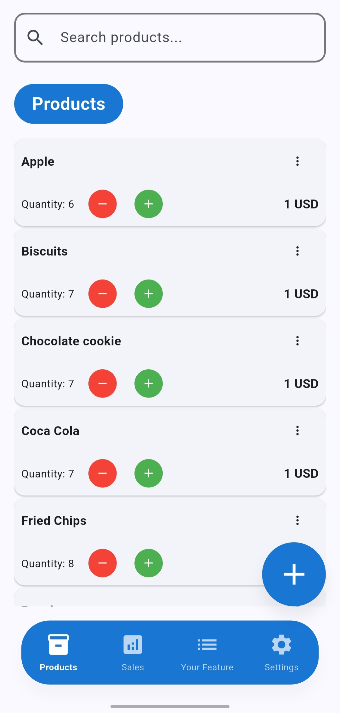
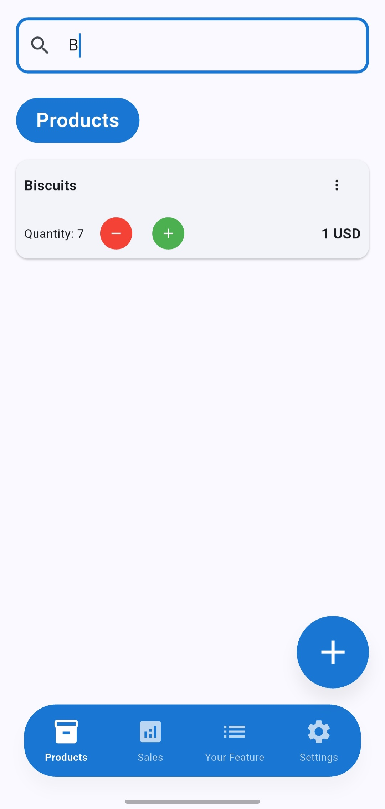
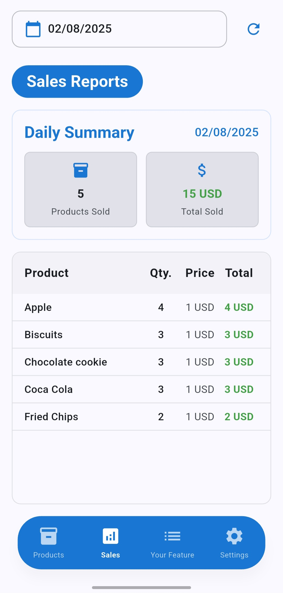
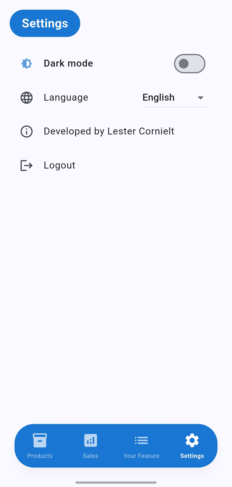
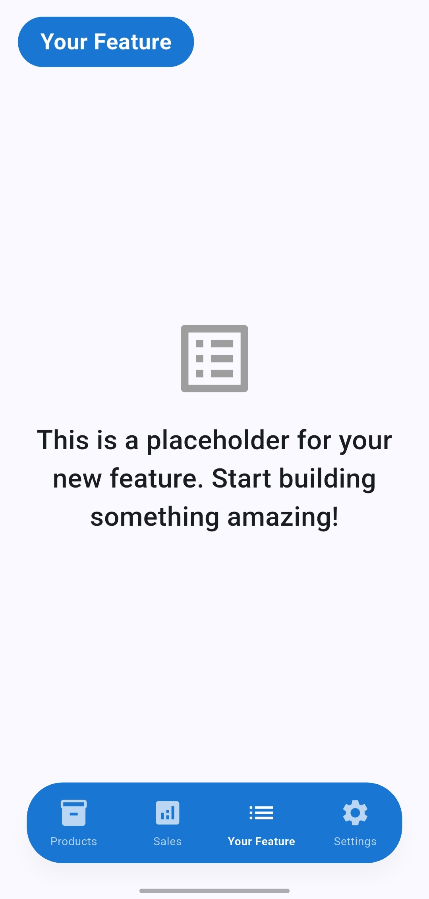

# Stockito

> ⚠️ **Not your language?**
>
> This README is in English. If you prefer another language, switch to the corresponding branch:
> - Spanish: `main`
> - Portuguese: `docs/portuguese-readme`

**Current status:** v1.0.0

Stockito is an inventory and sales application developed in Flutter, designed for small businesses and entrepreneurs. It allows you to manage products, register sales, and view daily reports in a simple and efficient way. Additionally, it is highly customizable to fit the specific needs of your business. You can add a specific feature in the your_feature view according to your requirements.

---

## 📱 Main Features

### 1. Product Management
- Add, edit, and delete products
- Quick search by name
- View stock and prices

<p>
  
  
</p>

### 2. Sales Reports
- Dedicated daily reports page ("Reports" tab)
- View sales by day and date selector
- Daily summary: total products sold and total amount
- Detailed list of sold products
- Handles empty and error states

<p>
  
</p>

### 3. Settings and User Experience
- Local SQLite database
- Persistent navigation and state between sessions
- Modern and responsive interface
- Multilanguage support (Spanish, English, Portuguese)
- Dark mode available in all features

<p>
  
</p>

### 4. Customization and Extensibility
- The app is designed to be easily customizable.
- You can add any additional functionality in the "Your Feature" view (`your_feature`).
- Ideal for developers who want to adapt the app to specific needs or experiment with new features.

<p>
  
</p>

---

## 🛠️ Technologies and Architecture

- **Framework:** Flutter
- **State management:** BLoC (flutter_bloc)
- **Dependency injection:** GetIt
- **Local database:** SQLite (sqflite)
- **Internationalization:** flutter_localizations, JSON files
- **Architecture:** Clean Architecture

---

## 🚀 Installation and Running

1. Download the latest APK from [Releases](https://github.com/LesterCornielt/stockito-inventory-app/releases/download/v1.0.0/Stockito.v1.0.0.apk).
2. Install it on your Android device.
3. Or, follow these steps to build from source:
   ```sh
   git clone https://github.com/LesterCornielt/stockito-inventory-app.git
   cd stockito-inventory-app
   ```
2. Install dependencies:
   ```sh
   flutter pub get
   ```
3. Run the app:
   ```sh
   flutter run
   ```

---

## 📂 Project Structure

- `lib/core/` - Base services, utilities, and dependency configuration
- `lib/features/` - Main features (products, sales, reports, settings)
- `lib/l10n/` - Localization files
- `assets/` - Graphic resources
- `screenshots/` - Screenshots

Architecture based on Clean Architecture, separating data, domain, and presentation to facilitate maintenance and scalability.

---

## 🤝 How to Contribute?

Contributions are welcome! To collaborate:

1. Fork the repository and clone it locally.
2. Create a branch for your feature or fix:
   ```sh
   git checkout -b my-feature
   ```
3. Make your changes and write descriptive commits.
4. Make sure the app compiles and follows the current best practices of the project.
5. Push to your fork and open a Pull Request to `main`.
6. Clearly describe your contribution in the PR.

**Recommendations:**
- Follow the existing architecture and patterns (Clean Architecture, BLoC, etc).

---

## 📝 License

MIT License. See the LICENSE file for more details.

