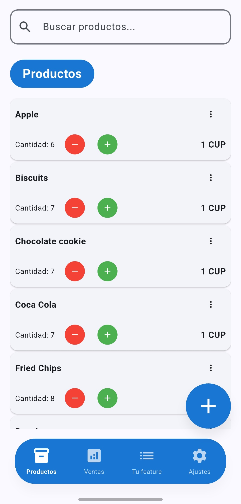
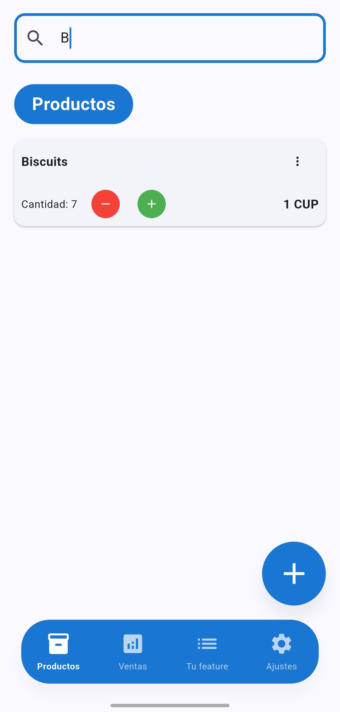
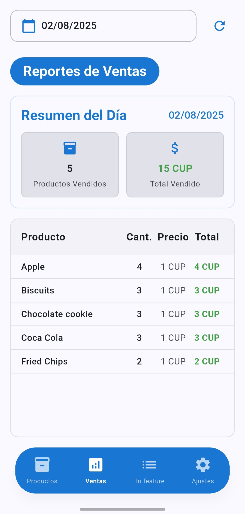
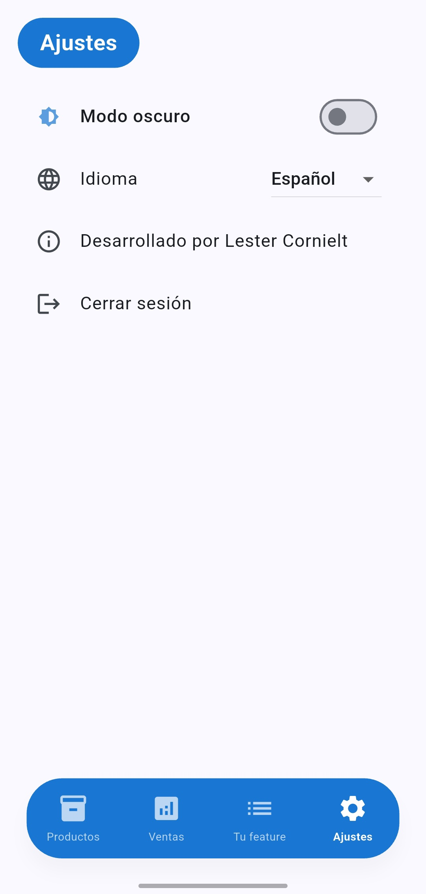
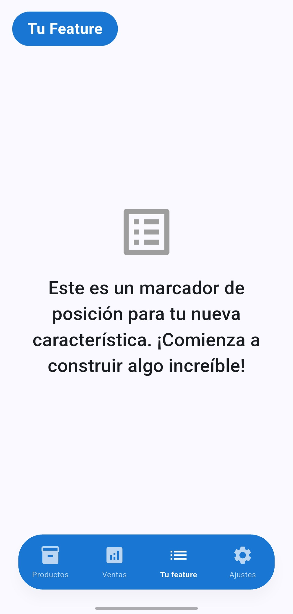

# Stockito

> ⚠️ **¿No es tu idioma?**
>
> Este README está en español. Si prefieres otro idioma, cambia a la rama correspondiente:
> - English: `docs/english-readme`
> - Portugues: `docs/portuguese-readme`

**Estado actual:** v1.0.0

Stockito es una aplicación de inventario y ventas desarrollada en Flutter, pensada para pequeños negocios y emprendedores. Permite gestionar productos, registrar ventas y visualizar reportes diarios de manera sencilla y eficiente. Además, es altamente personalizable para adaptarse a las necesidades de un negocio específico. Puedes agregar una feature específica en la vista de your_feature según los requerimientos de tu emprendimiento.

---

## 📱 Características principales

### 1. Gestión de productos
- Alta, edición y eliminación de productos
- Búsqueda rápida por nombre
- Visualización de stock y precios

<p>
  
  
</p>

### 2. Reportes de ventas
- Página dedicada a reportes diarios (pestaña "Reportes")
- Visualización de ventas por día y selector de fecha
- Resumen diario: total de productos vendidos y monto total
- Lista detallada de productos vendidos
- Manejo de estados vacíos y errores

<p>
  
</p>

### 3. Configuración y experiencia de usuario
- Base de datos local SQLite
- Navegación y estado persistente entre sesiones
- Interfaz moderna y responsiva
- Soporte multilenguaje (español, inglés, portugués)
- Modo oscuro disponible en todas las funcionalidades

<p>
  
</p>

### 4. Personalización y extensibilidad
- La aplicación está pensada para ser fácilmente personalizable.
- Puedes agregar cualquier funcionalidad adicional en la vista "Tu Funcionalidad" (`your_feature`).
- Ideal para desarrolladores que deseen adaptar la app a necesidades específicas o experimentar con nuevas características.

<p>
  
</p>

---

## 🛠️ Tecnologías y arquitectura

- **Framework:** Flutter
- **Gestión de estado:** BLoC (flutter_bloc)
- **Inyección de dependencias:** GetIt
- **Base de datos local:** SQLite (sqflite)
- **Internacionalización:** flutter_localizations, archivos JSON
- **Arquitectura:** Clean Architecture

---

## 🚀 Instalación y ejecución

1. Descarga la última versión del archivo APK desde [Releases](https://github.com/LesterCornielt/stockito-inventory-app/releases/download/v1.0.0/Stockito.v1.0.0.apk).
2. Instálalo en tu dispositivo Android.
3. O bien, sigue estos pasos para compilar desde el código fuente:

1. Clona el repositorio:
   ```sh
   git clone https://github.com/LesterCornielt/stockito-inventory-app.git
   cd stockito-inventory-app
   ```
2. Instala las dependencias:
   ```sh
   flutter pub get
   ```
3. Ejecuta la app:
   ```sh
   flutter run
   ```

---

## 📂 Estructura del proyecto

- `lib/core/` - Servicios base, utilidades y configuración de dependencias
- `lib/features/` - Funcionalidades principales (productos, ventas, reportes, configuración)
- `lib/l10n/` - Archivos de localización
- `assets/` - Recursos gráficos
- `screenshots/` - Capturas de pantalla

Arquitectura basada en Clean Architecture, separando datos, dominio y presentación para facilitar el mantenimiento y escalabilidad.

---

## 🤝 ¿Cómo contribuir?

¡Las contribuciones son bienvenidas! Para colaborar:

1. Haz un fork del repositorio y clónalo localmente.
2. Crea una rama para tu feature o fix:
   ```sh
   git checkout -b mi-feature
   ```
3. Realiza tus cambios y haz commits descriptivos.
4. Asegúrate de que la app compile y siga las buenas prácticas actuales del proyecto.
5. Haz push a tu fork y abre un Pull Request hacia `main`.
6. Describe claramente tu aporte en el PR.

**Recomendaciones:**
- Sigue la arquitectura y patrones existentes (Clean Architecture, BLoC, etc).

---

## 📝 Licencia

Licencia MIT. Consulta el archivo LICENSE para más detalles.

