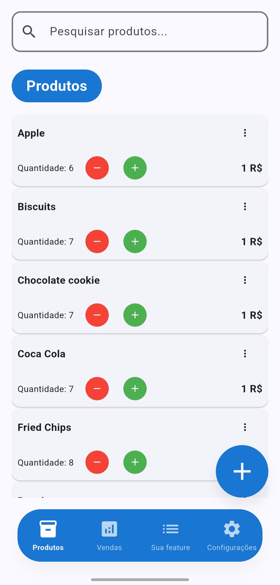
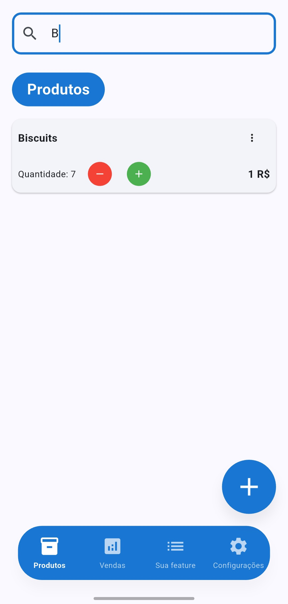
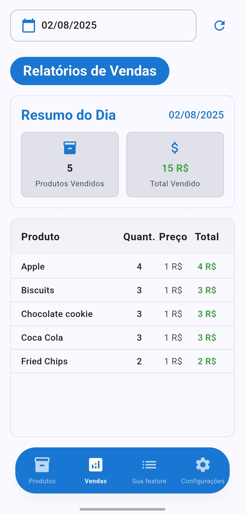
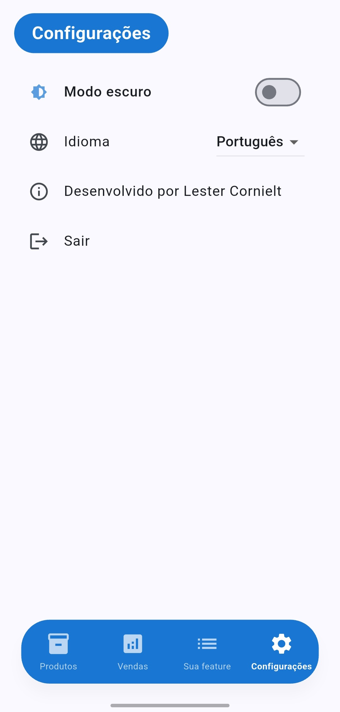
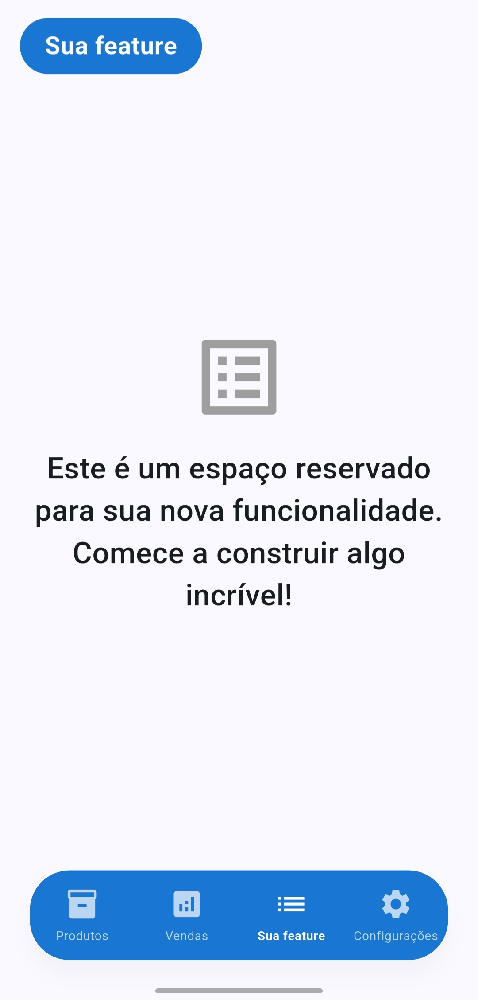

# Stockito

**Status atual:** v1.0.0

Stockito é um aplicativo de inventário e vendas desenvolvido em Flutter, pensado para pequenos negócios e empreendedores. Permite gerenciar produtos, registrar vendas e visualizar relatórios diários de forma simples e eficiente. Além disso, é altamente personalizável para se adaptar às necessidades específicas do seu negócio. Você pode adicionar uma funcionalidade específica na tela your_feature conforme os requisitos do seu empreendimento.

---

## 📱 Principais Funcionalidades

### 1. Gestão de Produtos
- Cadastro, edição e exclusão de produtos
- Busca rápida por nome
- Visualização de estoque e preços

<p>
  
  
</p>

### 2. Relatórios de Vendas
- Página dedicada a relatórios diários (aba "Relatórios")
- Visualização de vendas por dia e seletor de data
- Resumo diário: total de produtos vendidos e valor total
- Lista detalhada de produtos vendidos
- Tratamento de estados vazios e erros

<p>
  
</p>

### 3. Configurações e Experiência do Usuário
- Banco de dados local SQLite
- Navegação e estado persistente entre sessões
- Interface moderna e responsiva
- Suporte multilíngue (espanhol, inglês, português)
- Modo escuro disponível em todas as funcionalidades

<p>
  
</p>

### 4. Personalização e Extensibilidade
- O aplicativo foi projetado para ser facilmente personalizável.
- Você pode adicionar qualquer funcionalidade extra na tela "Sua Funcionalidade" (`your_feature`).
- Ideal para desenvolvedores que desejam adaptar o app para necessidades específicas ou experimentar novas funcionalidades.

<p>
  
</p>

---

## 🛠️ Tecnologias e Arquitetura

- **Framework:** Flutter
- **Gerenciamento de estado:** BLoC (flutter_bloc)
- **Injeção de dependências:** GetIt
- **Banco de dados local:** SQLite (sqflite)
- **Internacionalização:** flutter_localizations, arquivos JSON
- **Arquitetura:** Clean Architecture

---

## 🚀 Instalação e Execução

1. Clone o repositório:
   ```sh
   git clone https://github.com/LesterCornielt/stockito-inventory-app.git
   cd stockito-inventory-app
   ```
2. Instale as dependências:
   ```sh
   flutter pub get
   ```
3. Execute o app:
   ```sh
   flutter run
   ```

---

## 📂 Estrutura do Projeto

- `lib/core/` - Serviços base, utilitários e configuração de dependências
- `lib/features/` - Funcionalidades principais (produtos, vendas, relatórios, configurações)
- `lib/l10n/` - Arquivos de localização
- `assets/` - Recursos gráficos
- `screenshots/` - Capturas de tela

Arquitetura baseada em Clean Architecture, separando dados, domínio e apresentação para facilitar a manutenção e escalabilidade.

---

## 🤝 Como Contribuir?

Contribuições são bem-vindas! Para colaborar:

1. Faça um fork do repositório e clone localmente.
2. Crie um branch para sua feature ou correção:
   ```sh
   git checkout -b minha-feature
   ```
3. Faça suas alterações e commits descritivos.
4. Certifique-se de que o app compila e segue as boas práticas do projeto.
5. Faça push para seu fork e abra um Pull Request para `main`.
6. Descreva claramente sua contribuição no PR.

**Recomendações:**
- Siga a arquitetura e os padrões existentes (Clean Architecture, BLoC, etc).

---

## 📝 Licença

Licença MIT. Consulte o arquivo LICENSE para mais detalhes.

